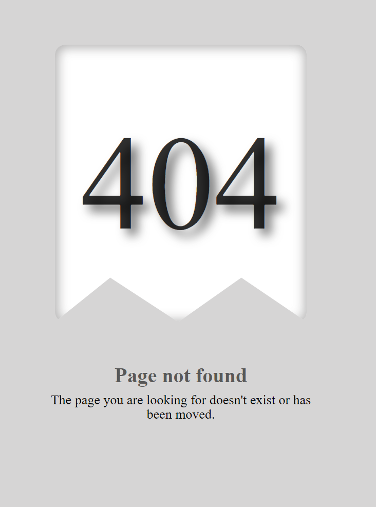

# Página de Error Personalizada -- STREAM



Este proyecto crea una página de error personalizada para informar a los usuarios que la página que buscan no fue encontrada (Error 404). Utiliza HTML para la estructura básica y CSS para un diseño atractivo y creativo.

## Tecnologías

- **HTML:** Estructura básica de la página.
- **CSS:** Estilo y diseño de la página.

## Estructura del Proyecto

La página de error se divide en las siguientes secciones:

- Header: Contiene un mensaje de error.
- Main: Muestra una imagen o ilustración relacionada con el error.

## Instalación y Uso

1. Clona el repositorio:

```bash
git clone https://github.com/3eze3/page-error.git
```

2. Navega al directorio del proyecto:

```bash
cd  Page 404
```

**Abre el archivo index.html en tu navegador para ver la página de error en acción.**

## Estructura de Archivos

- index.html: Contiene la estructura HTML de la página.
- styles.css: Incluye los estilos CSS para la página.
